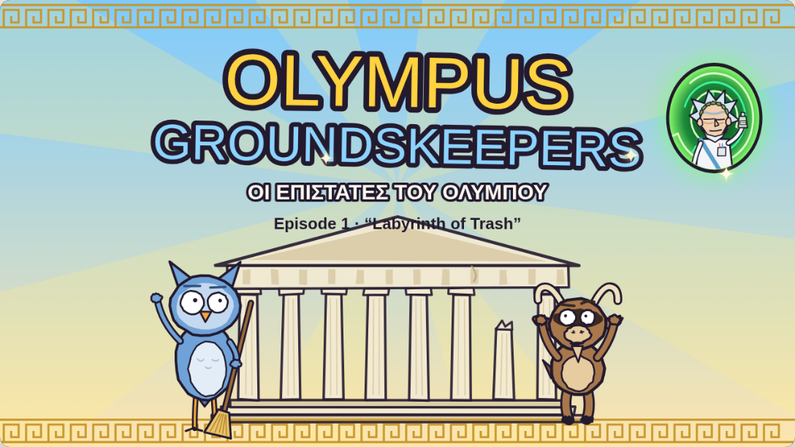
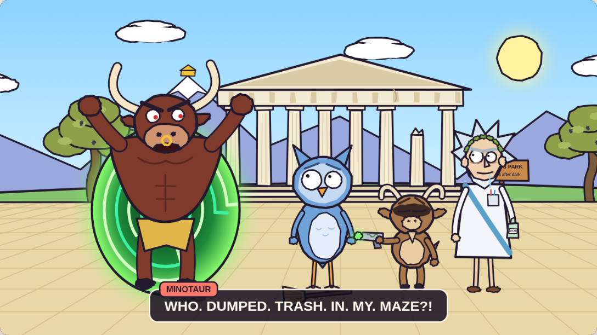
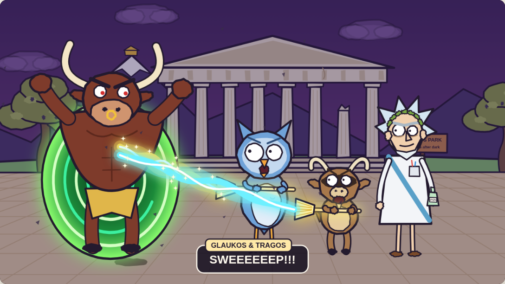
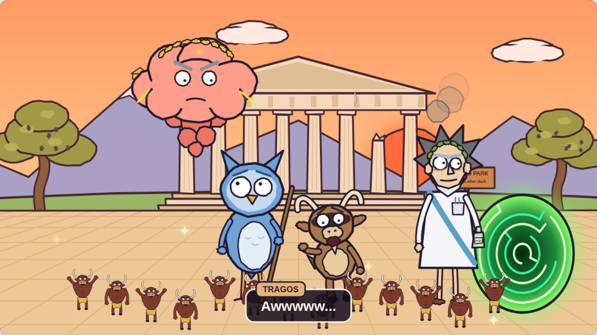

# Olympus Groundskeepers · Οι Επιστάτες του Ολύμπου

An animated Greek-mythology comedy that sits between **Rick and Morty** (sci-fi chaos, portals, a burping genius grandpa) and **Regular Show** (slacker park workers, a cranky boss, mundane chores that turn into cosmic battles).



## Watch the pilot

Open `index.html` in any modern browser and press **▶**. There's nothing to install or build.

- **Length:** about 1:19, with synthesized sound: Hijaz-mode bouzouki plucks, character babble and sound effects
- **ΕΛ / EN** switches the subtitles between Greek and English (the park sign changes too)
- **Space** plays or pauses, **← / →** skip 5 seconds, and **⛶** goes fullscreen
- Every frame is drawn in code on a `<canvas>`. Outlines "boil" at 8 fps to look hand-drawn.

---

## Series bible

### Premise
Mount Olympus has a public park, and somebody has to sweep it. **Glaukos** and **Tragos** are two underpaid, mortal groundskeepers who report to **Zeus**, a boss who is literally a storm cloud. Every episode starts with a simple chore. Their laziness, plus **Pappou Daedalus's** reckless inventions, turns that chore into a disaster big enough to threaten the whole cosmos. They fix it in the end with something small and ordinary, and usually get fired anyway.

### Characters

| Character | Role / inspiration | Look | Voice & personality |
|---|---|---|---|
| **Glaukos** (Γλαύκος) | The straight man (the Mordecai / Morty slot) | Tall, lanky blue owl with ear tufts and huge uneven dot-pupil eyes. Always holding a broom | Anxious and reasonable. Knows every plan is bad and goes along anyway. Former pet of Athena and never lets anyone forget it |
| **Tragos** (Τράγος) | The chaos gremlin (the Rigby slot) | Short goat-satyr with curled horns, a raccoon-style bandit mask, a goatee and hooves | Loud and lazy. Says *"OHHH! OHHHH!"* at every bad idea. Sure he's secretly a demigod |
| **Pappou Daedalus** (Παππούς Δαίδαλος) | The mad-genius grandpa (the Rick slot) | Wild white spiky hair, a unibrow, a laurel wreath, a "lab-toga" with pens in the pocket, and a flask of ouzo | Built the Labyrinth and Icarus's wings, and is still bitter about both. Burps mid-sentence. Believes nothing matters except good engineering |
| **Zeus** (Δίας) | The boss (the Benson slot) | A storm cloud with a face, a golden laurel and a cloud beard. Turns red and crackles when he gets angry | Screams *"YOU'RE FIRED!"* and throws lightning. Very occasionally, and briefly, says "good work" |
| **The Minotaur** (Μινώταυρος) | Recurring antagonist | Huge bull-man with a gold nose ring, a loincloth and red eyes | The Labyrinth's furious "landlord." Surprisingly into interior design |

### Style guide
- **Shapes:** simple and rounded like Regular Show, with thick dark-plum outlines (`#231a2e`) and flat fills without shading.
- **Faces:** R&M-style dot pupils, eyes of slightly different sizes, drool and eye bags on Daedalus.
- **Palette:** marble cream `#f3ead3`, Aegean sky `#6cc4ff`, olive `#8fa04a`, agora sand `#ead7a8`, gold `#ffd23f`. Portals are always neon labyrinth-green `#7CFF6B`.
- **Greek motifs:** meander (Greek key) borders on title and end cards, the Parthenon, olive trees, amphora shards, gyros wrappers in the trash, and a flask of ouzo.
- **Portals:** swirly like R&M portals, but drawn as spinning **labyrinths**, which is Daedalus's signature.
- **Lighting shifts, not cuts:** each act re-lights the same location. Day becomes an epic purple storm, which becomes sunset.
- **Escalation curve (Regular Show):** a boring chore → a shortcut → something supernatural → a glowing, over-the-top battle → a mundane resolution → the boss's verdict.

### Episode 1: "Labyrinth of Trash" (Ο Λαβύρινθος των Σκουπιδιών)
1. **Cold open:** Zeus orders the duo to sweep the Agora by sundown or be fired to Tartarus. Lightning strikes.
2. **The shortcut:** Daedalus steps out of a portal with his *Labyrinth Gun*, which can dump the trash into another dimension.
3. **The bad idea:** Tragos grabs the gun and fires it. All the trash gets sucked away… right into the Minotaur's maze.
4. **Escalation:** the furious Minotaur climbs out of the portal. *"WHO. DUMPED. TRASH. IN. MY. MAZE?!"*
5. **Epic battle:** Daedalus throws them cosmic Bronze Age brooms, and the duo sweeps the Minotaur back through the portal with glowing beams.
6. **Resolution:** at sunset the Agora is spotless and Zeus approves… until Daedalus burps open a new portal and fourteen tiny Minotaurs run out. *"YOU'RE ALL FIRED!"*





### Future episode ideas
- **Hermes gets a delivery drone:** it's faster than him, so he has an identity crisis and the duo has to make sure the drone "loses."
- **Icarus 2.0:** Daedalus makes new wings for Tragos. Wax is "a legacy technology."
- **Sisyphus Day:** the duo agrees to cover Sisyphus's shift for one afternoon.
- **Pandora's Lost & Found:** cleaning out the park's lost-and-found box is a terrible idea.
- **Cerberus Walks:** three heads, three leashes, and one squirrel.

## Project layout
```
index.html   the whole pilot: character rigs, backgrounds, script, camera, sound, player
stills/      frames exported from the pilot
```
To tweak the story, edit `LINES` (the dialogue in English and Greek, with timings), the `gState` / `tState` / `dState` / `zState` / `mState` blocking functions, and `CAMK` (camera keyframes) in `index.html`.
