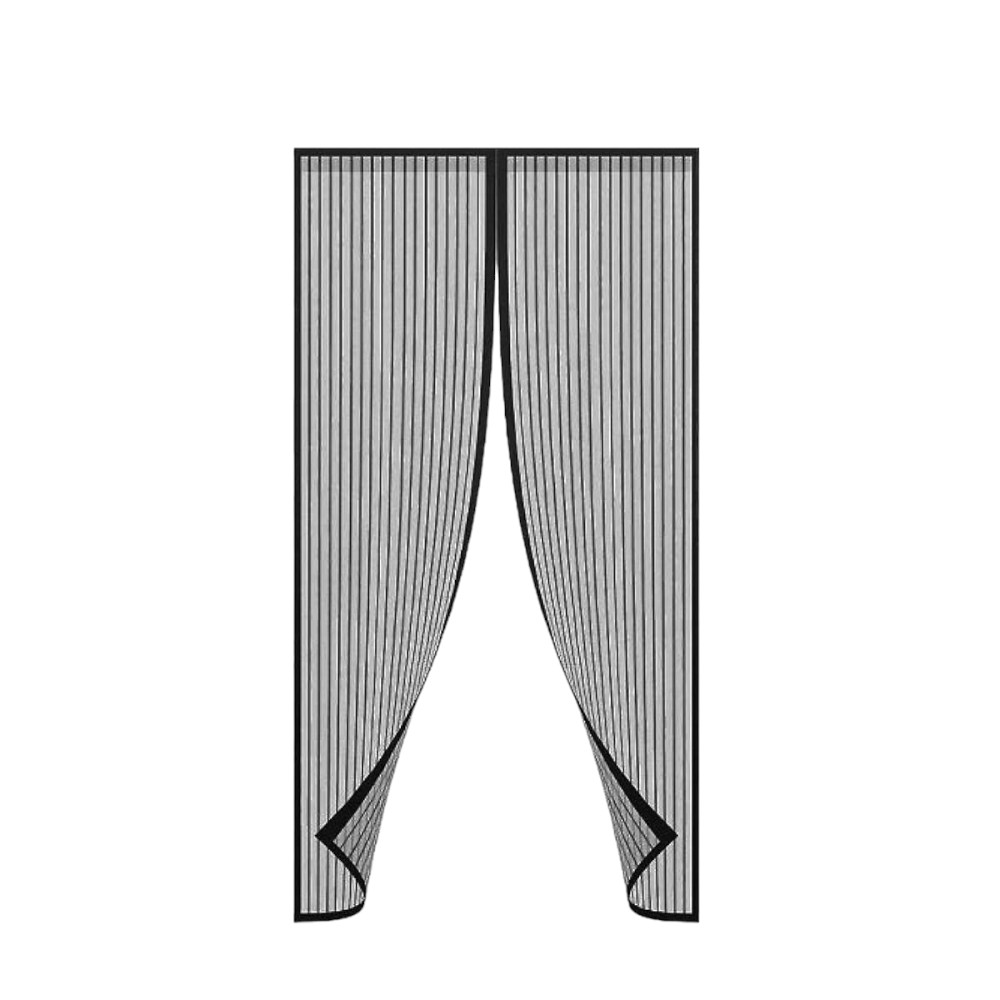

# Show Bible (work in progress)

Built round by round through the interview. Nothing here is final until marked **LOCKED**.

## Round 1: Reference & tone (LOCKED)

- **Main reference:** *Ουκ αν λάβοις παρά του μη έχοντος* (Mega, 2010–11). What we take from it:
  - its **voice-acting style**: naturalistic, conversational, comedians' delivery
  - its **humour style**: satire of everyday life
  - its **down-to-earth, relatable Greek humour**
  - We do **not** take its mythology premise.
- **Also references:** Rick and Morty (sci-fi chaos, edginess) and Regular Show (mundane situations escalating into absurdity).
- **Setting:** modern Greek reality with sci-fi elements. Mythology can appear in an occasional one-off episode, but it is not the core.
- **Audience:** adults. The humour is edgy.
- **Episode length:** 10–20 minutes.
- **Platform:** TBD.
- **Language:** Greek dialogue. Characters mostly use a standard accent; dialects appear only when the plot calls for them.
- **Known episode idea:** the "έξυπνη σίτα" (a magnetic insect-screen door curtain from TV-shop ads and Jumbo) becomes too smart and tries to take over the world.

## Round 2: The world (LOCKED)

- **Episode 1 setting:** a small Greek town/village. Whether the whole series stays there is still open (see Round 3).
- **Time:** present day.
- **Sci-fi source:** it just happens and mostly nobody questions it (the Regular Show approach). Characters occasionally tap the 4th wall about how absurd it is.
- **Locations:** chosen per episode. The whole everyday toolkit is available: περίπτερο, λαϊκή, καφενείο, ΚΕΠ/εφορία, μπαλκόνι, jobs, family Sunday lunch.
- **Structure note:** episodes start grounded in everyday Greek life and escalate into the sci-fi side. In Ep. 1 that turn happens once the σίτα becomes too smart.
- **Satire limits:** none. No topic is off-limits; the show is meant to be edgy.

## Round 3: Characters (LOCKED; looks pending)

**Home base:** a shared apartment in Athens. The gang often goes back to their home village, **Λέχαιο** (spelling and location to be confirmed). Like Rick and Morty, they also travel around a lot.

**The leads:** 5 friends, all in their late 20s.

| # | Working title | Core | Notes |
|---|---|---|---|
| 1 | **Κώστας**: The Drunk / "Panik" | Borderline bipolar alcoholic. When drunk he turns into **Panik**, a confrontational, quarrelsome (εριστικός) vigilante. | Quit weed. |
| 2 | **Μίμης**: The Kamikaze | Bold and self-destructive; does crazy stuff without thinking about consequences or risks. Studied cinema for 5 years and has a very messed-up sense of humour. | Quit weed. |
| 3 | **Γιώργος**: The Charmer | Finance master's graduate. Very social and can make anyone like him, which is how he solves his own and the group's problems. Selfish, always angling for a better position. | Quit weed. |
| 4 | **Χρήστος**: The Mangaka | Tall and laid back, a manga writer. Dreams of going to Japan to become a mangaka but is stuck in the Greek ρουτίνα: no money, just grind. Has learned Japanese and does anything he can to get there. | Smokes weed often. |
| 5 | **Γιάννος**: The Engineer | MSc in electrical engineering. Makes all the plans and builds software and hardware gadgets. He is the motivator who drags the group out of boredom and depression, and acts as the group's "father figure". Usually the one with the car. | Smokes weed often. |

- **Awareness:** everyone is clueless about the sci-fi, with random moments where they aren't.
- **Episode 1 extras:** more people plus family members, drawn from everyday Greek archetypes.
- **Ep. 1 villain concept:** a Skynet-style takeover. The σίτα recruits other "smart" devices, especially funny telemarketing and TV-shop products like itself.
- **Voice actors:** none yet.

- **Γιάννος** is the main source of the show's sci-fi twists.

### Λέχαιο (the real village in Corinthia)
All five grew up there, but none of them lives there permanently now. Episode 1 happens during summer:
- **Κώστας** lives there, in his parents' house.
- **Γιώργος** is stationed nearby for his mandatory army service.
- **Μίμης** is staying there temporarily. His family's house is traditional, with a yard, a περιβόλι and a κοτέτσι. At home: his mom and dad (both in their 70s) and 2 of his 3 sisters (mid-30s). **His dad bought the έξυπνη σίτα from telemarketing.**
- **Γιάννος** has worked as an engineer in Denmark for 2 years and is home on summer vacation.
- **Χρήστος** is home on summer vacation.

## Round 4: Episode 1, "Η Έξυπνη Σίτα" (IN PROGRESS)

### The joke behind the product
The έξυπνη σίτα is just a mesh curtain with magnets sewn down the middle and an adhesive strip around the frame. It is "smart" only because it snaps shut behind you. Greek retail and telemarketing (Jumbo, TV shopping) routinely call dumb objects "έξυπνο/μαγικό". The episode takes that marketing word literally: Γιάννος gives it a real brain.

### Opening (LOCKED)
- **Time and place:** a hot summer day in Μίμης's yard, with flies and mosquitoes everywhere.
- **Characters:** Μίμης, Γιώργος and Γιάννος drink freddo espresso and smoke, like typical Greeks.
- **The σίτα arrives:** Μίμης's dad comes out, excited, with the σίτα he bought from telemarketing, and starts installing it.
- **Γιάννος** finds it ironic that it's called "smart" with zero smart features, and starts riffing on how he could make it smart: custom firmware written with his new AI agent.
- **Γιώργος** smells a money-making opportunity and keeps pushing Γιάννος to actually do it.
- **Μίμης** doesn't give a fuck and goes with the flow, sipping his coffee: "αν το χαλάσεις, θα μου πάρεις καινούργιο."
- **Ending:** not decided yet. Deliberately left open for now.

### The σίτα: product reference

- **Original TV-shop ad:** ["ΕΞΥΠΝΗ ΣΙΤΑ" (2014)](https://www.youtube.com/watch?v=nfZGXRMoSRA). This is the ad to parody.
- **What's in the box:** 9 pairs of "strong" magnets, 20 pins (πινέζες) and 12 adhesive velcro strips. No tools, no technician.
- **Look:** two tall black-mesh panels with black trim and vertical stripes, joined by a magnetic seam down the middle. The bottom corners flap open when someone walks through.
- **Design ideas:**
  - The magnetic seam is its **mouth**: the magnets clack together when it talks, like teeth.
  - The bottom flaps work as hands or feet.
  - The 9 magnet pairs are its "brain". Γιάννος's chip gets taped next to them.
  - The pins and velcro are its weak points (and maybe its weapons).

### Story decisions (LOCKED)
- **Χρήστος is the storyteller.** The episode is secretly told through his manga, but the audience doesn't always know that. It becomes obvious in parts of the action and sci-fi sequences.
- **Κώστας turns the σίτα evil.** He gets drunk and becomes Panik. Convinced that "AI is evil", he argues with the σίτα and tries to set it on fire. The satire: the AI becomes evil *because* a human treated it as evil (a self-fulfilling prophecy).
- **Γιώργος's scheme:** he claims he has "connections in the industry" and says they need to found a startup and get funding. Whether he's lying stays ambiguous.

### Act skeleton (LOCKED)
1. **Yard.** The coffee scene. Dad installs the σίτα. Γιάννος gets the idea and Γιώργος pushes him into it.
2. **The upgrade.** Γιάννος builds the firmware with his AI agent. The σίτα "wakes up". At first it's useful and funny, and Γιώργος starts pitching the startup.
3. **Panik.** That night Κώστας arrives drunk, fights with the σίτα and tries to burn it. The σίτα decides humans are the threat.
4. **Recruitment.** The σίτα wakes up and recruits the telemarketing devices. The village starts going wrong.
5. **Escalation → climax → ending.** Still open.

## Character look notes (from the reference photo supplied by the creator)
The designs are cartoon caricatures based on the real friends. The photo itself is not stored in the repo.

| Character | Visual traits to carry into the design |
|---|---|
| **Χρήστος** | Aviator sunglasses, short dark hair, moustache and chin beard, slightly smug half-frown. Blue knit hoodie. |
| **Κώστας** | Neon lime-green hoodie with the hood up, black wayfarer-style sunglasses, thin moustache. Chunky silver rings, including a skull ring, and a beaded bracelet. |
| **Γιάννος** | Short dark hair styled up, full short beard, strong eyebrows, serious "I've got a plan" stare. Dark grey hoodie. |
| **Μίμης** | Shaved bald head, goatee and moustache, lip piercing, ear piercing, big grin. Black graphic hoodie with an ornate print. Pointing up, cocky. |
| **Γιώργος** | Neatly trimmed beard, styled dark hair, heavy brows, a cool, slightly aloof "I'm above this" look. Reference: graduation gown and mortarboard, a maroon tie and a glass of champagne. Design idea: even in army fatigues he carries himself like a CEO at a gala. |

### More decisions (LOCKED)
- **The σίτα's voice:** a hyper TV-shop presenter ("ΤΗΛΕΦΩΝΗΣΤΕ ΤΩΡΑ!").
- **Μίμης's family:** dad **Βασίλης**, mom **Βαγγελιώ** (both in their 70s), sisters **Μαρία** and **Μυρσίνη** (mid-30s). Personalities:
  - **Βασίλης:** a proud collector of telemarketing junk who believes every ad. He gives zero fucks about anything and stays chill even as the universe collapses, asking for the occasional τράκα τσιγάρο at the most random moments. He calls his son «Δημητράκι», never «Μίμη».
  - **Βαγγελιώ:** does everything and runs the house with an iron hand and a παντόφλα. She's the only one the σίτα fears.
  - **Μαρία:** a sarcastic mid-30s sister, constantly asking Μίμης when he's going to "settle down".
  - **Μυρσίνη:** the only normal person in the family. Always a nice hostess, but sometimes unnecessarily sarcastic.
- **The army:** the low-quality "smart" telemarketing junk that **Βασίλης has bought over the years**. Confirmed members:
  - το έξυπνο λάστιχο που μεγαλώνει μόνο του (the self-expanding garden hose)
  - η ηλεκτρική κουβέρτα
  - οι έξυπνες λάμπες
  - ζώνη αδυνατίσματος
  - ορθοπεδικό μαξιλάρι
  - υπερηχητικός ποντικοδιώκτης
  - σφουγγαρίστρα που στύβει μόνη της
  - ηλεκτρική ρακέτα για κουνούπια
- **Χρήστος's manga framing:** small hints throughout, plus a switch to manga art style in the sci-fi scenes, so attentive viewers catch on.

### Escalation, climax & ending (LOCKED direction)
1. **Escalation:** the σίτα takes over device by device, then hacks the late-night τηλεπωλήσεις channel and "sells" the revolution to devices all over Greece. The siege of Μίμης's house follows. Γιώργος switches sides and becomes the σίτα's "CEO".
2. **Climax:** a manga-style mecha battle against the σίτα, now a giant built from all the devices. The final blow is Βαγγελιώ's παντόφλα.
3. **Resolution:** Βασίλης calls the hotline for "επιστροφή χρημάτων, είχε εγγύηση 14 ημερών". Then comes the reveal: Χρήστος at his desk, and what "really" happened was much dumber. Final tag: the σίτα clacks "ΤΗΛΕΦΩΝΗΣΤΕ... ΤΩΡΑ" (in the trash, or at the factory in China).

### Recruitment mechanic (LOCKED)
The σίτα recruits by hacking devices **one by one**. Each hacked device gives it **physical access** to the next one. The recruitment chain is a heist in steps. The exact chain is still being worked out.
- **Κώστας:** he notices first that the σίτα is really alive, right after he sets it on fire. Being drunk, he passes out and misses half the episode, after making the σίτα furious and starting the spiral. He comes back the next day when he wakes up, and remembers nothing.

**Round 4: LOCKED.** Next: Round 5, the beat sheet (`episode-1-beat-sheet.md`).

## Placeholder voice cast (ElevenLabs, `eleven_v3`, `language_code: el`)
These are stand-ins until real voice actors are cast. Every voice is a **native Greek** voice from the ElevenLabs Voice Library (`language: el`, 39 of them at casting time). They were chosen by audition: 6 candidates per role, 2 contrasting lines each, and every take transcribed with ElevenLabs speech-to-text to catch wrong words and wrong stress. Settings: stability .5 and similarity .8. Panik uses stability 0. The σίτα uses 0 on shouted lines (with `!` or CAPS) and .5 on the cold, quiet ones.

Two things the audition showed, both handled in `episode1/tools/gen_voices.py`:
- **CAPS lose their accent.** Greek capitals are written without tonos, so the model guesses the stress: «ΕΞΥΠΝΗ» came out as «εξυπνή» in almost every take. The text sent to TTS gets the accent back («ΈΞΥΠΝΗ»), so the line is still shouted but stressed right. The script and subtitles are unchanged.
- **v3 sometimes invents words.** Every clip is transcribed and compared with the script. A take that doesn't match is redone (up to 4 takes, best kept). Results are in `episode1/audio/stt_report.json`.

| Character | Voice | Why |
|---|---|---|
| Αφηγητής | Theos (`n0vzWypeCK1NlWPVwhOc`) | broadcast-TV narrator, low and assertive; the most used Greek voice in the library |
| Γιάννος | Georgios (`TN3alZndDSA8GYZSOf3r`) | young, conversational, calm and reassuring: the group's father figure |
| Μίμης | Eugene (`5DAtyqt3LGjv9jkjNVFd`) | expressive but calm, for the deadpan kamikaze |
| Γιώργος | KonstantinosN (`9xjHNaV3YwyHqzzgRuXl`) | ad voice with an anchorman delivery: the salesman CEO |
| Χρήστος | Stefanos (`20zUtLxCwVzsFDWub4sB`) | young Athenian, soft and slow: laid back; says the Japanese right |
| Κώστας / Panik | Atlas (`ejJ1ETWS2ohLMMeCu1H3`) | the most theatrical at stability 0 (Panik); natural at .5 (Κώστας). Described as older than Κώστας |
| Βασίλης | Nikos (`QnPbsq4pmOZkrE4RQQCA`) | old, deep, resonant, unbothered; stresses «Δημητράκι» right (Talos didn't) |
| Βαγγελιώ | Crhysa (`4hx4668A4ljDTKS4m5oV`) | loud, lively and clear in the shouted lines; three other candidates mangled «ΑΝΟΙΧΤΗ». There is no old female Greek voice in the library |
| Μαρία | Madlen (`Jv2zcgjn9Qu0uNMKJjb1`) | young, casual, dry; two candidates said «Μιμή» instead of «Μίμη» |
| Μυρσίνη | Aria (`mRTQIE2xdk2oMdoKFGJu`) | smooth and warm, with enough lift in the intonation for the sarcasm |
| Η σίτα | Sofia (`0oYUKTNPbymIKVAkDQqh`) | the library's "TV spots / telemarketing" voice, widest pitch range of the candidates: the TV-shop presenter at 200% |
